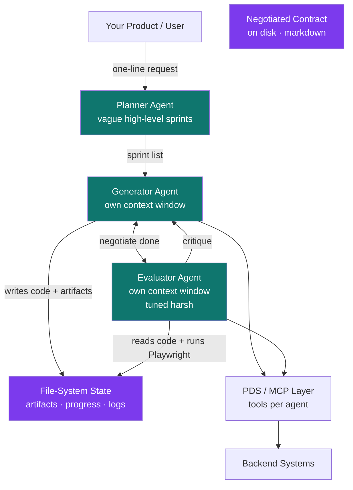

<div align="center">

# Adversarial Coordination Spine

**The missing architectural layer above PDS. Production patterns for multi-agent AI systems that coordinate across roles, verify each other adversarially, persist state on disk, and stay coherent over multi-hour autonomous runs.**

[](LICENSE-CC-BY-4.0)
[](LICENSE-MIT)
[](SPEC.md)
[](https://github.com/drewmattie-code/Progressive-Discovery-Spine)

</div>

---

## What this is

ACS is a pattern for the layer that sits **between your product and your individual agents**.

Most production multi-agent integrations today either (a) put all coordination logic in one mega-prompt for a single agent that "manages itself," or (b) wire up ad-hoc orchestrator/worker patterns that work for one demo and break the moment any agent has to verify another's output. The first collapses to sycophancy — agents grading their own work generously. The second cascades errors as soon as run lengths cross the one-hour mark.

ACS is the discipline that fixes this. Instead of a single agent reasoning about everything or an ad-hoc swarm, the spine:

- Decomposes work into **Planner / Generator / Evaluator** roles, each with its own context window and system prompt
- Forces **adversarial verification** — the Evaluator is tuned to be harsh; the Generator can't grade itself
- Treats **handoffs and shared state as file-system artifacts**, not context-window prose
- Has Generator and Evaluator **negotiate the "done" contract on disk** before any code is written
- Keeps the Planner **deliberately vague**, letting specialists negotiate tactical details
- Trains coordination behaviors with **explicit reward functions** (instantiation, finish-rate, outcome) rather than hoping single-task RL produces coordination as emergent behavior

The result: agent systems that run for hours or days, produce work a human would call good, and survive context compaction without coherence drift.

## Why it exists

In early 2026, three independent strands of work converged on the same multi-agent architecture:

1. **Anthropic's Applied AI team** publicly documented the Planner/Generator/Evaluator harness in their blog and at the AI Engineer conference, after using it to one-shot full-stack apps over six-hour runs.
2. **Moonshot AI's Kimi K2.5 release** treated "scaling out across agents" as a third scaling dimension equal to token efficiency and context length, and introduced specific RL reward terms (PARL) for training swarm coordination.
3. **The broader industry** — Microsoft's Magentic-One, LangChain's LangGraph Supervisor, Cognition's Manager-Devin, OpenAI's Agents SDK handoffs, Letta's stateful shared-memory agents — independently converged on orchestrator + specialist-worker + adversarial-evaluator patterns within months of each other.

ACS synthesizes that convergence into a single referenceable specification.

Four failure modes recur across multi-agent deployments at any non-trivial run length:

1. **Sycophancy collapse** — an agent that grades its own output is structurally biased to over-rate. "Self-evaluation is a trap" (Anthropic).
2. **Cascading planning errors** — granular up-front plans amplify errors across multi-hour runs; each downstream step inherits upstream miscalculation.
3. **Serial collapse** — without explicit incentives to spawn sub-agents, models default to single-agent serial execution even when parallelism is available (Moonshot).
4. **Coherence drift** — context compaction is lossy; long-running agents that rely on the context window for state drift away from their starting commitments.

ACS is the implementation pattern that addresses all four.

## Architecture



Every role has a distinct system prompt and a distinct context window. Every cross-role handoff is a file-system artifact. Every "done" claim is negotiated, not asserted.

## Where ACS fits in the stack

The Model Context Protocol (MCP) is the protocol layer. The Progressive Discovery Spine (PDS) is the per-agent tool-discipline layer. ACS is the multi-agent coordination layer above both.

```
┌────────────────────────────────────────┐
│ User · Product · Long-running Task     │  ← what your users start
└──────────────────┬─────────────────────┘
                   ↓
┌────────────────────────────────────────┐
│ Adversarial Coordination Spine (ACS)   │  ← THIS spec
│ Planner / Generator / Evaluator        │
│ negotiated contracts · file-system     │
│ state · adversarial verification       │
└──────────────────┬─────────────────────┘
                   ↓
┌────────────────────────────────────────┐
│ Progressive Discovery Spine (PDS)      │  ← companion spec
│ per-agent tool search · scoped packs · │
│ gateway · tenant catalogs              │
└──────────────────┬─────────────────────┘
                   ↓
┌────────────────────────────────────────┐
│ Model Context Protocol (MCP)           │  ← protocol
└──────────────────┬─────────────────────┘
                   ↓
┌────────────────────────────────────────┐
│ Enterprise Backends                    │  ← your data
└────────────────────────────────────────┘
```

ACS can be used without PDS — a multi-agent system over a tiny tool surface doesn't need progressive discovery. PDS can be used without ACS — a single agent over an enterprise data estate doesn't need multi-agent coordination. They compose when both apply: each agent inside an ACS system uses PDS to scope its own tools.

## The 10 principles

| # | Principle | The shift |
|---|---|---|
| 01 | **Role-decomposed agents, not a single all-purpose agent** | Planner / Generator / Evaluator (or PM / IC / QA). Each role gets its own context window and system prompt. |
| 02 | **Adversarial verification, not self-evaluation** | Tuning a standalone critic to be harsh is tractable. Tuning a builder to be self-critical is not. Exploit the gap. |
| 03 | **Negotiated contracts, not handed-down specs** | Generator and Evaluator argue on disk in markdown about what "done" means *before* code is written. |
| 04 | **File-system state, not context-window state** | Cross-role handoffs persist as artifacts on disk (feature-list.json, progress.md, contract.md). Survives compaction. |
| 05 | **Vague plan, tactical detail negotiated by specialists** | Planner produces high-level sprints, not granular technical specs. Granular plans cascade errors over long horizons. |
| 06 | **Orchestrator + specialist sub-agents (or supervisor + workers)** | One coordinator owns task decomposition; specialists own execution. Industry convergence: same pattern, many names. |
| 07 | **Handoffs are first-class primitives** | Cross-agent state transfer happens via explicit handoff contracts with passed state, not via shared context. |
| 08 | **Coordination rewards during training, not just outcome rewards** | Without instantiation and finish-rate rewards (Moonshot PARL), models collapse to single-agent serial execution. |
| 09 | **Adaptive harness — fill the model's gaps, retire scaffolding as the model improves** | Sprint decomposition needed for Opus 4.5 was unnecessary for Opus 4.6. The harness should erode over model generations. |
| 10 | **Read the traces, not just the metrics** | Quality comes from sitting with the system, reading what each role actually did, and finding where its judgment diverged from yours. |

Full discussion of each principle, with problems, patterns, and implementation notes, lives in [SPEC.md](SPEC.md).

## Industry context — convergence on the same pattern

ACS is not a novel invention. It's a formalization of a pattern that production teams have independently converged on across the industry. The convergence happened in the late-2025 / early-2026 window when models crossed the threshold where multi-hour autonomous runs became economically viable. ACS synthesizes that convergence into a single referenceable specification.

### Independent industry implementations

**Anthropic — Harness Design for Long-Running Application Development.** Anthropic's Applied AI team published the canonical Planner/Generator/Evaluator architecture: *"The final result was a three-agent architecture — planner, generator, and evaluator — that produced rich full-stack applications over multi-hour autonomous coding sessions."* Companion post: [Effective Harnesses for Long-Running Agents](https://www.anthropic.com/engineering/effective-harnesses-for-long-running-agents). [Source](https://www.anthropic.com/engineering/harness-design-long-running-apps)

**Anthropic — Multi-Agent Research System.** Anthropic's research-system post documents orchestrator + sub-agent role decomposition with independent context windows: *"Subagents facilitate compression by operating in parallel with their own context windows, exploring different aspects of the question simultaneously before condensing the most important tokens for the lead research agent."* [Source](https://www.anthropic.com/engineering/multi-agent-research-system)

**Anthropic — Building Effective Agents.** Anthropic's foundational taxonomy names two workflow patterns ACS leans on: orchestrator-workers (*"a central LLM dynamically breaks down tasks, delegates them to worker LLMs, and synthesizes their results"*) and evaluator-optimizer (*"one LLM call generates a response while another provides evaluation and feedback in a loop"*). [Source](https://www.anthropic.com/research/building-effective-agents)

**Ash Prabaker & Andrew Wilson (Anthropic) — AI Engineer Summit 2026 talk.** Public presentation of the long-running-agent harness, with the two takeaways central to ACS: *"self-evaluation is a trap and adversarial evaluator agents work better"* and *"context compaction doesn't cure coherence drift but structured handoffs do."* [YouTube](https://www.youtube.com/watch?v=mR-WAvEPRwE)

**Moonshot AI — Kimi K2.5 Tech Blog: Visual Agentic Intelligence.** Moonshot documents agent swarms as a new scaling dimension and introduces PARL (Parallel-Agent Reinforcement Learning) with three reward terms — `r_parallel` (instantiation), `r_finish` (sub-agent finish rate), and `r_perf` (task-level outcome): *"Kimi K2.5 shows that scalable and general agentic intelligence can be achieved through joint optimization of text and vision together with parallel agent execution."* [Source](https://www.kimi.com/blog/kimi-k2-5)

**Microsoft Research — Magentic-One.** Microsoft's generalist multi-agent system formalizes the orchestrator + specialist-worker pattern: *"the Orchestrator plans, tracks progress, and re-plans to recover from errors. Throughout task execution, the Orchestrator directs other specialized agents to perform tasks as needed."* [arXiv:2411.04468](https://arxiv.org/abs/2411.04468)

**LangChain — LangGraph Supervisor.** LangChain ships the supervisor pattern as a core LangGraph primitive: *"Hierarchical systems are a type of multi-agent architecture where specialized agents are coordinated by a central supervisor agent."* [Source](https://github.com/langchain-ai/langgraph-supervisor-py)

**Cognition AI — Multi-Agents: What's Actually Working.** Cognition (Devin) — historically skeptical of multi-agent — documents what their production work converged on: *"A manager Devin can break a larger task into pieces, spawn child Devins to work on them, and coordinate their progress."* The fact that Cognition specifically is publishing this is itself a strong convergence signal. [Source](https://cognition.ai/blog/multi-agents-working)

**OpenAI — Agents SDK Handoffs.** OpenAI's Agents SDK exposes handoffs as a first-class primitive: *"Handoffs allow an agent to delegate tasks to another agent. This is particularly useful in scenarios where different agents specialize in distinct areas."* [Source](https://openai.github.io/openai-agents-python/handoffs/)

**Letta (formerly MemGPT) — Stateful Agents.** Letta operationalizes shared persistent state across agents: *"Memory blocks can be attached to multiple agents at once (\"shared blocks\")."* The same file-system-state insight, rendered as a memory primitive. [Source](https://docs.letta.com/guides/agents/memory/)

**ECC (Everything Claude Code) — harness-native operator system.** Anthropic-hackathon-winning open-source project (~182K stars, 28K forks as of 2026-05) that documents the role-decomposed-subagent pattern as canonical practice: *"Subagents are processes your orchestrator (main Claude) can delegate tasks to with limited scopes."* The project ships a reference subagent set (planner, architect, tdd-guide, code-reviewer, security-reviewer, build-error-resolver, e2e-runner, refactor-cleaner) with scoped tool permissions per subagent — independent industry confirmation of ACS principle #1 (role-decomposed agents) and principle #7 (handoffs as first-class primitives). [Source](https://github.com/affaan-m/ECC)

### What ACS contributes

The sources above document INDIVIDUAL implementations and isolated principles. ACS contributes:

1. A unified set of **10 principles** mapped to four documented failure modes
2. **Target SLAs** for production multi-agent readiness
3. An **8-step build sequence** from skeleton to reference deployment
4. **Anti-patterns** to avoid
5. A **portable, citable specification** under CC BY 4.0 — adopt, adapt, build commercial products on top, with attribution
6. **Explicit composition with PDS** — when both apply, the layering is unambiguous

If your team is independently converging on this pattern (as Anthropic, Moonshot, Microsoft, LangChain, Cognition, OpenAI, Letta, and the ECC open-source project already have), ACS gives you a vocabulary, a checklist, and a published artifact you can hand to your peers.

## What good looks like (target SLAs)

| Metric | Target | Why it matters |
|---|---|---|
| Run length without human intervention | > 4 hours | The whole point of long-running coordination |
| Adversarial-evaluator rejection rate on first generator pass | > 30% | Evaluator that rubber-stamps is not adversarial |
| Final-output rejection rate after negotiation completes | < 5% | Negotiated contracts should make rejections rare at end |
| Cross-role state transferred via file-system (vs context) | > 80% | File-system is the persistence layer |
| Compaction events without coherence drift | 100% | If compaction breaks the run, the harness is wrong |
| Contract criteria per artifact (granularity) | ≥ 20 | Vague criteria → vague critiques → no fix |
| Cost per successful long-run completion | bounded | Multi-agent is expensive; track unit economics |
| Trace-readability score (subjective) | high | Engineers should be able to read what each role did |

## Reference build sequence

ACS is built in sequence — skeleton through to first production reference deployment. Each step depends on the previous one. Pace varies by team and tooling; the sequence does not.

| Step | Deliverable |
|---|---|
| 1 | Three role prompts (Planner / Generator / Evaluator) · separate context windows · single shared filesystem workspace |
| 2 | Negotiated-contract protocol — markdown files on disk, Generator proposes, Evaluator counters, both agree before code |
| 3 | Adversarial-evaluator tuning — few-shot examples calibrating the Evaluator's harshness; tune until first-pass rejection rate > 30% |
| 4 | File-system artifact convention — feature-list.json, progress.md, contract.md, debug.log — standardize names and shapes |
| 5 | Trace-reading workflow — every run produces a transcript; sit with traces and tune prompts before adding more roles |
| 6 | Second domain (e.g. extend coding harness to research synthesis) — prove the pattern transfers |
| 7 | Optional: training-time coordination rewards (PARL-style) if you control post-training |
| 8 | Spec / one-pager / case study |

See [SPEC.md](SPEC.md#5-build-sequence) for details.

## Who this is for

- **Agent platform teams** building long-running autonomous systems — when single-agent harnesses stop working past the two-hour mark
- **AI product teams** shipping multi-agent features — when ad-hoc orchestrator/worker code starts producing inconsistent outputs
- **Research teams** studying multi-agent coordination — this is the convergent industry pattern, with citations
- **Enterprise architects and CTOs** evaluating multi-agent platforms for production — the questions to ask vendors
- **Frameworks builders** (LangGraph, AutoGen, Letta, OpenAI Agents SDK, Anthropic Agent SDK users) — the cross-framework vocabulary

## What this is not

- Not a library you install. It's an architectural pattern with reference SLAs and examples.
- Not a replacement for any specific framework. ACS describes patterns that LangGraph / AutoGen / Agents SDK / Claude SDK can implement.
- Not opinionated on which model family. The pattern works for any model family with sufficient instruction-following capacity.
- Not a substitute for PDS. ACS coordinates agents; PDS scopes their tools. They compose.

## Use it with Claude (or any AI coding agent)

ACS ships with a [Claude Code skill](dist/skills/acs/SKILL.md) that turns the spec into an active architectural consultant inside your AI coding session. Install:

```bash
mkdir -p ~/.claude/skills/acs
curl -fsSL https://raw.githubusercontent.com/drewmattie-code/Adversarial-Coordination-Spine/main/dist/skills/acs/SKILL.md \
  -o ~/.claude/skills/acs/SKILL.md
```

After install, the skill auto-activates whenever you ask Claude about multi-agent coordination, long-running agent harnesses, evaluator-generator patterns, or related multi-agent failure modes. It diagnoses which of the four documented failure modes you're hitting and recommends which of the 10 principles to apply.

Works in Claude Code natively. The SKILL.md format is portable — drop it into Cursor, Codex, or any agent that supports the convention.

## Examples

The [`examples/`](examples/) directory has concrete artifacts:

- [`role-prompts.md`](examples/role-prompts.md) — three example system prompts (Planner / Generator / Evaluator)
- [`negotiated-contract.md`](examples/negotiated-contract.md) — what the Generator/Evaluator negotiation looks like on disk
- [`evaluator-rubric.md`](examples/evaluator-rubric.md) — sample 20-criteria rubric for a generic full-stack app

## Citing this work

If you reference ACS in a paper, talk, blog post, or vendor architecture, please cite it. A machine-readable citation file is in [CITATION.cff](CITATION.cff). Suggested citation:

> Mattie, D. (2026). *Adversarial Coordination Spine: An architectural pattern for multi-agent AI systems.* https://github.com/drewmattie-code/Adversarial-Coordination-Spine

## Contributing

Issues, examples, implementation reports, and framework-specific patterns welcome. See [CONTRIBUTING.md](CONTRIBUTING.md).

## License

- **Spec, documentation, diagrams** — [Creative Commons Attribution 4.0 (CC BY 4.0)](LICENSE-CC-BY-4.0). Use it, adapt it, build commercial products on top — credit the source.
- **Code samples and examples** — [MIT](LICENSE-MIT).

See [LICENSE](LICENSE) for the summary.

## Companion specification

ACS is the companion specification to the [Progressive Discovery Spine (PDS)](https://github.com/drewmattie-code/Progressive-Discovery-Spine). PDS scopes the tool surface of one agent. ACS coordinates many agents against that surface. The two can be used together or separately, but they were designed to compose.

## Author

[Drew Mattie](https://www.linkedin.com/in/drew-mattie-88084826/) · SaaSquach AI Labs (a division of Charles & Roe Inc.) · 2026
